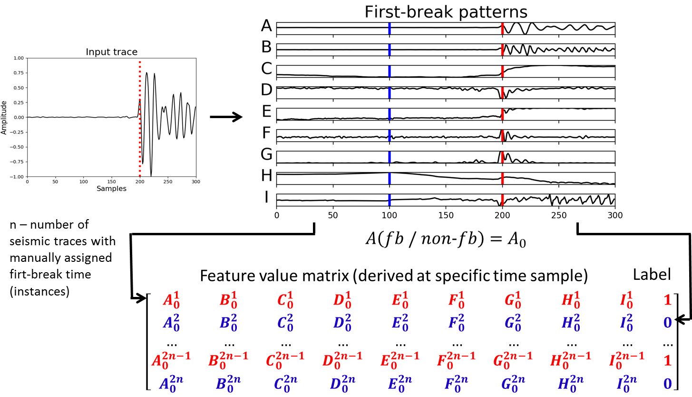
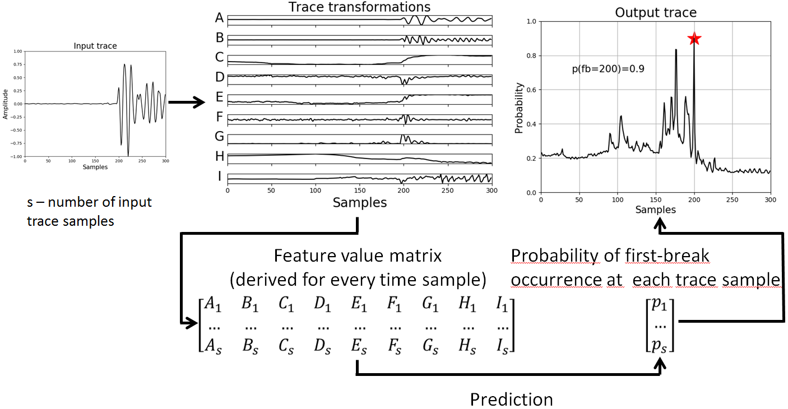

# fbpicker
## Multi-pattern algorithm for first-break picking employing open-source machine learning libraries

Accurate first-break (FB) onsets are crucial in processing seismic data, e.g. for deriving statics solution or building velocity models via tomography. Ever-increasing volumes of seismic data require automatic algorithms for FB picking. Most of the existing techniques are based either on simple triggering algorithms that rely on basic properties of seismic traces or on neural network architectures that are too complex to be easily trained and re-used in another survey. Here we propose a solution that addresses the issue of multi-level analysis using a time-sequence pattern-recognition process implemented in the newest open-source machine learning library like Keras or Scikit-Learn. We use well-established methods such as STA/LTA, entropy, fractal dimension or higher-order statistics to provide patterns required for generative model training with artificial neural networks (ANN), Support Vector Regression (SVR) and an implementation of gradient boosted decision trees – XGBoost (Extreme Gradient Boosting). FB picking is cast as the binary classification that requires a model to differentiate FB sample from all other samples in a seismic trace. Our workflow (provided freely as a Jupyter Notebook) is robust, easily adaptable and flexible in a way of adding new pattern generators that might contribute to even better performance, while already-trained models can be saved and re-used for another dataset collected with similar acquisition parameters (e.g., in multi-line surveys). Application to real seismic data showed that the models trained on 1000 and 340,100 manually-picked FB onsets are able to predict FB on the rest of 470,000 of traces with the success rate of nearly 90% and 95%, respectively.

This repository contains IPython Notebook with sample code and arbitrary seismic traces, complementing research artictle about automatic first-break picking:

https://www.sciencedirect.com/science/article/pii/S0926985119302435

You can view **"training.ipynb"** and **"prediction.ipynb"** directly on github, or clone the repository, install dependencies listed in the notebook and play with code locally.

# Training

# Prediction

